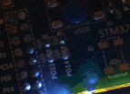

# EventDrivenSystem

Ссылка на топик форума с разработчиком https://electronix.ru/forum/index.php?app=forums&module=forums&controller=topic&id=150729&page=12

 Часть первая. Анализ рынка велосипедной продукции

 

Когда ViKo только открыл трэд, прозвучала мысль о не желании использовать какую-либо ОС, а сделать все на флаговом автомате в суперцикле.

Я предложил использовать модель событийного механизма - обычная Event-driven system. Этот механизм еще давно показался мне достаточно интересным и оправданным в случае проектирования ПО без ОСРВ.

Напоминаю, в чем суть Event-driven system (EDS): в системе заводится некая очередь событий; объекты-источники этих событий (обычно формируемые прерываниями по таймерам, ADC, SPI и т.д., что угодно) помещают эти события в очередь. С другой стороны, основной суперцикл работает всегда и опрашивает эту очередь на предмет возникших в системе изменений. Обо всем этом можно прочитать, например, тут.

Однако, как на мой взгляд, такой подход тоже не лишен недостатков: даже с таблицей состояний и переходов, построение программы окажется, в некоторой степени, головной болью - множество глобальных переменных-состояний, код отдельных процедур будет невозможно писать линейно без привязки к архитектурной модели самой EDS. Последнее значит, что, например, даже используя замечательный механизм protothreads от Adam Dunkels, все ранее написанные библиотеки придется "допиливать" под использование в суперцикле. Даже каждую функцию, если она использует хотя бы одну длительную операцию, ожидающую события. За примером-подтверждением мне далеко идти не пришлось - смотрите сами
  Hide contents

static int makeXmlLine(struct pt *pt, char* dst, char* src)
{
    static char* text; // должна быть static чтоб значение не потерялось до выхода из функции
    char * pch;
    PT_BEGIN(pt);
    strcpy(dst,"<?xml version=\"1.0\" encoding=\"Windows-1251\"?>");
    PT_YIELD(pt);
    strcpy(dst,"<text>");
    PT_YIELD(pt);
    text=strdup(src); // strtok портит исходный текст, нужно его сохранить
    pch = strtok (text," ,.!?:");
    while (pch != NULL){
        sprintf(dst,"    <word>%s</word>",pch);
        PT_YIELD(pt);
        pch = strtok (NULL, " ,.!?:");
    }
    strcpy(dst,"</text>");
    PT_YIELD(pt);
    *dst=0; // Пустая строка будет индикатором того, что поток строк закончился
    PT_YIELD(pt);
    free(text);
    PT_END(pt);
}

 

PT_YIELD() - это как раз тот самый механизм сохранения промежуточных состояний системы, обеспечивающий запоминание места в коде, куда следующий раз нужно будет вернуться для выполнения с этого положения. Выглядит коряво, не правда ли?

 

По сути, протопотоки - это та же самая switch-case технология, детально описанная В. Татарчевским в его статьях, но красиво обернутая в макросы.

Хочу сразу отметить, что я нацелен всегда стремиться к тому, что, если функция чего-то ожидает (аппаратное событие), то нужно каким-то образом передать управление другим задачам, которые могут в этот момент спокойно выполняться параллельно.

Мне не понравился подход switch-case (и, соответственно, protothreads), потому как:

1. Каждая функция проекта должна быть переписана в автоматном стиле.

2. Из п. 1 вытекает следствие, что, если у меня сотни или тысячи функций, переписать придется их все, причем, помимо возможных внесенных багов, увеличится расход ОЗУ на глобальные статические флаги состояний этих функций.

 

Часть вторая. Своя недоОСька

 

В общем, что я хочу сделать (объяснение на пальцах).

Есть у меня, допустим, следующая задача: измерить температуру с нескольких датчиков DS18B20 и, раз в 1 секунду, отправлять ее по UART в запакованном байт-стаффингом виде третьей стороне. Также эта третья сторона может отправлять на нашу железку другие команды - управление дискретными выходами, отправка какого-нибудь набора байт по SPI и т.д. Задача простая и, поэтому, ставить ОС никакой необходимости нет. Используя подход EDS, получаем примерно такой main()

int main(void)
{
  HW_MCUInit();
  HW_PeriodicTimerStart();
  
  while(1)
  {
    u32 Event = EDS_GetEvent();
    if(Event)
      EDS_EventHandler(Event);
  }
}

 

EDS_EventHandler(), опираясь на полученное событие, выбирает из таблицы указатель на соответствующий обработчик и вызывает его. В этом обработчике мы можем (теоретически) обработать данное событие. И эти обработчики мы и могли бы нафаршировать switch-case автоматами, но минус такого подхода я озвучил выше.

Из импровизированного ТЗ мы выяснили, что раз в 1с устройство должно отправлять температуру по UART. Логично было бы тогда реализовать процедуру запуска преобразования, чтения и отправки по UART необходимых данных в самом обработчике события по секундному таймеру. То есть: таймер формирует прерывания раз в 1с, в прерывании мы записываем в очередь событий выделенный идентификатор этого события, а в суперцикле main() вычитаем это событие и вызываем обработчик

void PeriodicTimer_Handler(void)
{
  ONEWIRE_StartConversion();
  
  Delay(500);
  
  s16 Temperature[2];
  ONEWIRE_ReadTemperature(Temperature);
  
  HW_UARTSendTemperature(Temperature);
  
  return;
}

 

И вот здесь и возникает, собственно, проблема: наличие длительных операций, таких как ONEWIRE_StartConversion(), Delay(500) и всех остальных, будет жутко "тормозить" систему, делая ее однопоточной - то есть, пока тот же Delay(500) (полсекунды (!!!)) не отработает, управление не передастся диспетчерскому суперциклу, и мы можем пропустить своевременную обработку событий. Решение - сделать эту функцию асинхронной - при вызове ее сделать необходимые действия, а встретив длительную операцию, назначить обработчик для ее выполнения и выйти отсюда. Но программа получится просто адской сатаной - кучи обработчиков, ничего не ясно. Можно использовать другое решение - protothreads, но, как мы выяснили, читабельность кода пострадает, как и ресурсы времени выполнения кода и расхода ОЗУ МК.

На ум приходит механизм кооперативной многозадачности - при встрече длительной операции мы меняем контекст задачи. От его использования одни плюсы: не нужно дополнительных флагов в каждой функции всех библиотек (работа с 1-Wire в моем случае и т.д.), код выглядит также, как в проекте под управлением ОСРВ или даже без нее! Таким образом, можно построить сколько угодно функций-задач (по виду схожих с используемыми в ОСРВ), и они будут работать как бы "независимо".

Итак, идея понятна - реализовать кооперативную многозадачность без использования готовых ОСРВ, причем желательно максимально просто.

Чтобы "налегке" реализовать это, я пока что поставил задачу мигания двумя светодиодами из двух потоков - один из одного, другой из другого. С разной частотой. Дальше будет код с пояснениями в виде комментариев. МК - STM32F429.

Вот эти задачи

void TaskLED1(void)
{
  while(1)
  {
    EDS_SemaphoreTake(&LED1Semaphore); // ждем, когда дадут поработать этой задаче
    
    static u8 LedToggleFlag = 0;
    
    if(LedToggleFlag)
      HW_LEDOn(HW_LED1);
    else
      HW_LEDOff(HW_LED1);
    
    LedToggleFlag = !LedToggleFlag;
  }
}

void TaskLED2(void)
{
  while(1)
  {
    EDS_SemaphoreTake(&LED2Semaphore); // ждем, когда дадут поработать этой задаче
    
    static u8 LedToggleFlag = 0;
    
    if(LedToggleFlag)
      HW_LEDOn(HW_LED2);
    else
      HW_LEDOff(HW_LED2);
    
    LedToggleFlag = !LedToggleFlag;
  }
}

 

А вот теперь мой main()

int main(void)
{
  HW_MCUInit();                                  // инициализация периферии МК
  
  EDS_CreateTask(EDS_TASK_LED1, &TaskLED1, 128); // создание задачи мигания LED1
  EDS_CreateTask(EDS_TASK_LED2, &TaskLED2, 128); // создание задачи мигания LED2
  
  EDS_LaunchTask(EDS_TASK_LED1);                 // запуск задачи мигания LED1
  EDS_LaunchTask(EDS_TASK_LED2);                 // запуск задачи мигания LED2
  
  HW_PeriodicTimerStart();                       // запуск периодического таймера
  
  while(1)                                       // стандартный механизм EDS
  {
    u32 Event = EDS_GetEvent();
    if(Event)
      EDS_EventHandler(Event);
  }
}

 

HW_MCUInit() ничем особым не отличается - в нем обычная настройка периферии МК, требующейся для данного проекта.

EDS_CreateTask() создает задачу. Под созданием задачи понимается выделение ей стека и назначение обработчика. Смотрим реализацию

#define EDS_CreateTask(ID, HANDLER, STACK_SIZE) do                                                       \
                                                {                                                        \
                                                  static u32 __Stack##ID[STACK_SIZE];                    \
                                                  __Stack##ID[STACK_SIZE - 15] = 0x01000000;             \
                                                  __Stack##ID[STACK_SIZE - 1]  = (u32)HANDLER;           \
                                                  extern void *EDS_TaskContextSP[EDS_MAX_TASK_QUANTITY]; \
                                                  EDS_TaskContextSP[ID] = &__Stack##ID[STACK_SIZE - 15]; \
                                                }while(0)

 

То есть выделяется глобальный статический массив под стек задачи, настраиваются первоначальные значения регистров, чтобы при смене контекста мы попали в нужную задачу. В EDS_TaskContextSP[] содержатся как раз верхушки стеков всех задач.

 

Функция EDS_LaunchTask() запускает задачу. Она реализована как обыкновенный вызов функции EDS_SwitchContext(), которая, в свою очередь, выглядит так
  Reveal hidden contents

 

Функция переключения контекста имеет прототип

void EDS_SwitchContext(u8 TaskID);

и принимает на вход уникальный идентификатор задачи, который ей присвоили при вызове EDS_CreateTask().

 

Теперь смотрим на реализацию семафоров

#define SEMAPHORE_RESET    0
#define SEMAPHORE_SET      1
#define SEMAPHORE_WAIT     2

typedef struct
{
  u8 TaskID;
  u8 Semaphore;
}sEDSSemaphore;

sEDSSemaphore LED1Semaphore = {EDS_TASK_LED1};
sEDSSemaphore LED2Semaphore = {EDS_TASK_LED2};

void EDS_SemaphoreGive(sEDSSemaphore *SHandle)
{
  u8 SemaphoreState  = SHandle->Semaphore;
  SHandle->Semaphore = SEMAPHORE_SET;
  
  if(SemaphoreState == SEMAPHORE_WAIT)
    EDS_SwitchContext(SHandle->TaskID);
  
  return;
}

void EDS_SemaphoreTake(sEDSSemaphore *SHandle)
{
  if(SHandle->Semaphore == SEMAPHORE_SET)
    SHandle->Semaphore = SEMAPHORE_RESET;
  else
  {
    SHandle->Semaphore = SEMAPHORE_WAIT;
    
    EDS_SwitchContext(EDS_TASK_ROOT);
    
    SHandle->Semaphore = SEMAPHORE_RESET;
  }
  
  return;
}

 

TaskID нужен для того, чтобы знать, какую задачу разбудить (нужно же ведь как-то знать, какая задача ждала именно этот семафор).

Когда вызывается EDS_SemaphoreGive(), мы устанавливаем семафор в активный уровень, а затем, если этот семафор уже ожидался какой-то задачей, переключаемся на эту задачу.

Когда вызывается EDS_SemaphoreTake(), мы сбрасываем семафор и выходим из функции (это значит, что мы находимся итак в том потоке, который потребовал ожидания семафора). Если же семафор не был установлен, мы переводим его в режим ожидания и переключаем контекст на корневой поток - суперцикл в main() для обработки всех других событий.

Вот, собственно, и все.

 

После того, как все заработало (светодиоды дружно моргают), можно сделать вывод, что и в той задаче с датчиками и UART-ом все должно работать:biggrin:

 

Кстати хочу отметить, что для обмена данными между задачами можно использовать ту же глобальную очередь событий, поэтому никакие запреты прерываний для работы с семафорами не нужны.

Если кому интересно - файлы проекта прилагаю, можете поизучать. Проект был написан и продуман за день, поэтому не ожидайте от него многого - многие вещи возможно будут обнаружены неоптимальными - в этом случае я буду только рад слышать рекомендации и пожелания.

 

P.S. Не дописана функция EDS_Timeout() - пока что думаю как лучше сделать. 

 Сейчас я реализовал таймерную службу. Теперь потоки полноценно похожи на FreeRTOS-ные

void TaskLED1(void)
{
  while(1)
  {
    HW_LEDOn(HW_LED1);
    EDS_Timeout(50);
    HW_LEDOff(HW_LED1);
    EDS_Timeout(2100);
  }
}

void TaskLED2(void)
{
  while(1)
  {
    HW_LEDOn(HW_LED2);
    EDS_Timeout(50);
    HW_LEDOff(HW_LED2);
    EDS_Timeout(950);
  }
}

 

Таймерная служба работает с 1мс интервалом (настраивается аппаратным таймером, а можно вообще на SysTick повесить).

Результат работы вышеприведенных задач на плате STM32F429I-Disco (только щас заметил, что при переделке видео в gif-анимацию зеленый светодиод "пропадает", на деле - все ок) 

